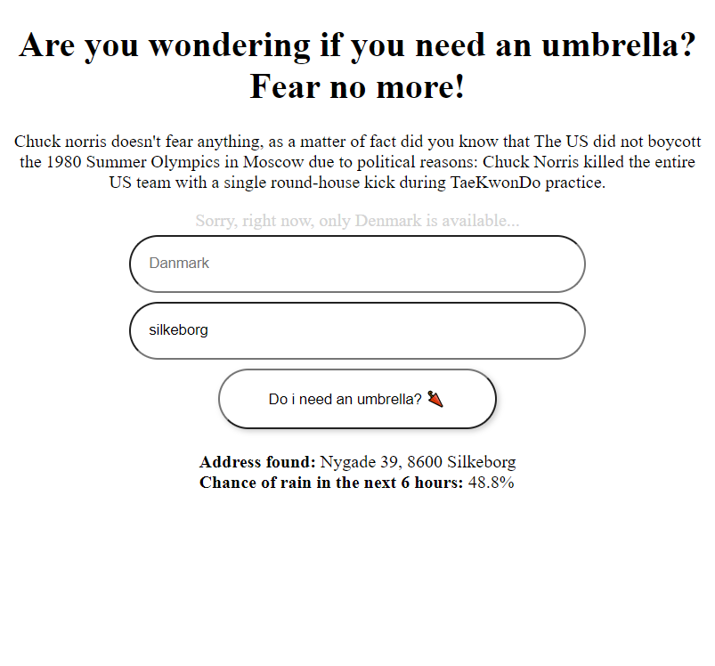

# JB Code Test

Code test from Jyske Bank, the [foundational code](https://github.com/jb-roa/umbrella-app) is from [Rasmus Holm Andersen /bj-roa](https://github.com/jb-roa)



## Requirements / Features

* All new features have unittests
* Facts are still shown for a fun user experience
* Closest address is shown / address is sanitized in backend
* The probability of rain is shown
* The user story is fulfilled

### Note that

* Some features may require some more refactoring

## To build and run with one command

```bash
docker-compose up --build
```

Webbapp can be openened here: [http://localhost:4200](http://localhost:4200)

## JB Code Challenge optional foundation

Optional foundation project for the JB code challenge. The project consists of a frontend and a backend template. Feel free to use the template and change whatever you prefer to solve the challenge.

### Build and run backend (no changes)

With JDK11+ and Maven

```bash
cd backend
mvn package
java -jar target/umbrella.jar
```

### Build and run frontend (no changes)

With Node 10+ and NPM

```bash
cd frontend
npm install
npm start
```

### To run with Docker Compose (no changes)

```bash
docker-compose up --build
```

### To open the application

Open this URL in your preferred browser: [http://localhost:4200](http://localhost:4200)
